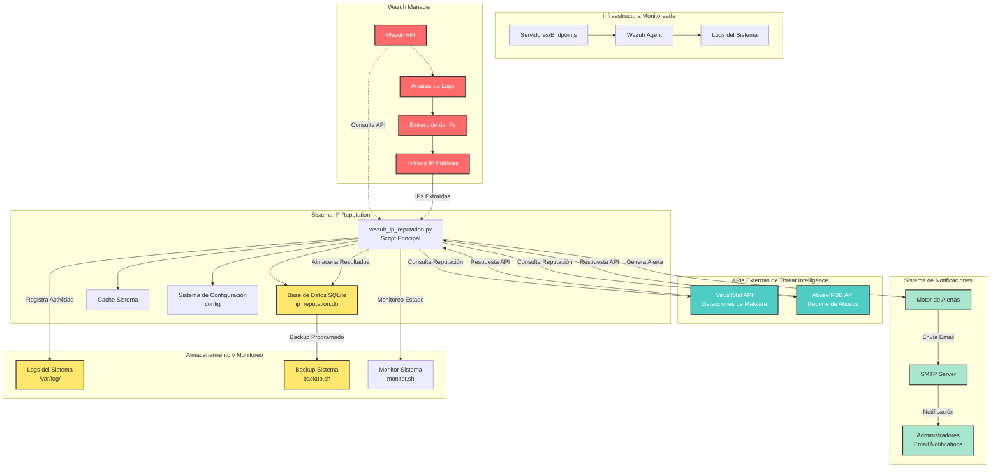
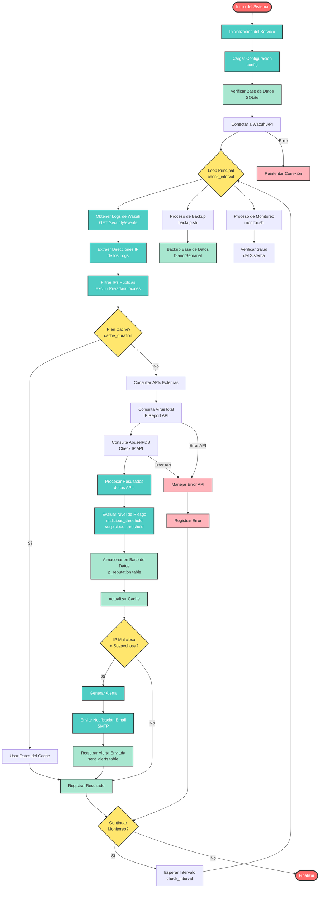

# Wazuh IP Reputation Checker

Sistema automatizado para verificar la reputación de direcciones IP encontradas en los logs de Wazuh utilizando VirusTotal y AbuseIPDB.

## Características

- **Análisis automático**: Extrae IPs de los logs de Wazuh y verifica su reputación
- **Múltiples fuentes**: Utiliza VirusTotal y AbuseIPDB para verificación
- **Alertas automáticas**: Envía notificaciones por email para IPs maliciosas
- **Base de datos**: Almacena resultados en SQLite para análisis histórico
- **Cache inteligente**: Evita consultas repetitivas a las APIs
- **Monitoreo continuo**: Ejecuta verificaciones de forma automática
- **Fácil despliegue**: Script de instalación automatizado

## Requisitos del Sistema

- Ubuntu 24.04 LTS
- Python 3.10+
- Acceso a Wazuh Manager API
- Conexión a internet para APIs externas
- Privilegios de administrador para instalación

## Instalación

### 1. Descarga e Instalación

```bash
# Descargar el proyecto
git clone https://github.com/your-repo/wazuh-ip-reputation.git
cd wazuh-ip-reputation

# Ejecutar instalación
sudo chmod +x install.sh
sudo ./install.sh
```

### 2. Configuración

Editar el archivo de configuración:

```bash
sudo nano /opt/wazuh-ip-reputation/config
```

#### Configuración de APIs

**VirusTotal API Key:**
1. Registrarse en https://www.virustotal.com/
2. Obtener API key desde https://www.virustotal.com/gui/my-apikey
3. Configurar en el archivo config:
   ```ini
   [apis]
   virustotal_key = YOUR_VIRUSTOTAL_API_KEY_HERE
   ```

**AbuseIPDB API Key:**
1. Registrarse en https://www.abuseipdb.com/
2. Obtener API key desde https://www.abuseipdb.com/account/api
3. Configurar en el archivo config:
   ```ini
   [apis]
   abuseipdb_key = YOUR_ABUSEIPDB_API_KEY_HERE
   ```

#### Configuración de Wazuh

```ini
[wazuh]
host = YOUR_WAZUH_MANAGER_IP
port = 55000
username = wazuh-user
password = wazuh-password
verify_ssl = false
```

#### Configuración de Email

```ini
[email]
enabled = true
smtp_server = smtp.gmail.com
smtp_port = 587
username = your_email@gmail.com
password = your_app_password
from_email = wazuh-alerts@yourdomain.com
to_emails = admin@yourdomain.com,security@yourdomain.com
```

### 3. Iniciar el Servicio

```bash
# Iniciar servicio
sudo systemctl start wazuh-ip-reputation

# Habilitar inicio automático
sudo systemctl enable wazuh-ip-reputation

# Verificar estado
sudo systemctl status wazuh-ip-reputation
```

## Uso

### Comandos Básicos

```bash
# Ver logs del servicio
sudo journalctl -u wazuh-ip-reputation -f

# Ejecutar análisis único
sudo -u wazuh-reputation /opt/wazuh-ip-reputation/venv/bin/python3 /opt/wazuh-ip-reputation/wazuh_ip_reputation.py --once

# Reiniciar servicio
sudo systemctl restart wazuh-ip-reputation

# Detener servicio
sudo systemctl stop wazuh-ip-reputation
```

### Backup Manual

```bash
sudo -u wazuh-reputation /opt/wazuh-ip-reputation/backup.sh
```

### Monitoreo Manual

```bash
sudo -u wazuh-reputation /opt/wazuh-ip-reputation/monitor.sh
```

## Estructura de Archivos

```
/opt/wazuh-ip-reputation/
├── wazuh_ip_reputation.py    # Script principal
├── config                    # Configuración
├── config.default            # Configuración por defecto
├── ip_reputation.db          # Base de datos SQLite
├── backup.sh                 # Script de backup
├── monitor.sh                # Script de monitoreo
├── venv/                     # Entorno virtual Python
├── logs/                     # Logs del sistema
└── backup/                   # Backups de la base de datos
```

## Base de Datos

### Tablas

1. **ip_reputation**: Resultados de análisis de reputación
2. **sent_alerts**: Registro de alertas enviadas
3. **processed_ips**: Log de IPs procesadas

### Consultas Útiles

```sql
-- IPs maliciosas detectadas
SELECT * FROM ip_reputation WHERE is_malicious = 1;

-- IPs con alta confianza de abuso
SELECT * FROM ip_reputation WHERE abuseipdb_confidence > 75;

-- Estadísticas por país
SELECT country_code, COUNT(*) as count 
FROM ip_reputation 
WHERE is_malicious = 1 
GROUP BY country_code;

-- Alertas enviadas hoy
SELECT * FROM sent_alerts 
WHERE DATE(sent_at) = DATE('now');
```

## Configuración Avanzada

### Umbrales de Detección

```ini
[thresholds]
# Número de detecciones en VirusTotal para considerar maliciosa
malicious_threshold = 5

# Número de detecciones para considerar sospechosa
suspicious_threshold = 2

# Porcentaje de confianza en AbuseIPDB
abuse_confidence_threshold = 75
```

### Intervalos de Verificación

```ini
[general]
# Intervalo entre verificaciones (segundos)
check_interval = 300

# Duración del cache (segundos)
cache_duration = 3600

# Nivel de logging
log_level = INFO
```

## Monitoreo y Alertas

### Tipos de Alertas

1. **IP Maliciosa**: Alta confianza de actividad maliciosa
2. **IP Sospechosa**: Indicadores de actividad sospechosa

### Contenido de Alertas

- Dirección IP
- Nivel de prioridad
- País de origen
- Tipo de uso reportado
- Puntuaciones de reputación
- Recomendaciones de acción

## Solución de Problemas

### Problemas Comunes

1. **Error de autenticación con Wazuh**
   ```bash
   # Verificar credenciales en config
   sudo nano /opt/wazuh-ip-reputation/config
   
   # Verificar conectividad
   curl -k https://WAZUH_HOST:55000/security/user/authenticate
   ```

2. **APIs no responden**
   ```bash
   # Verificar conectividad
   curl -v https://www.virustotal.com/vtapi/v2/ip-address/report
   curl -v https://api.abuseipdb.com/api/v2/check
   ```

3. **Servicio no inicia**
   ```bash
   # Ver logs detallados
   sudo journalctl -u wazuh-ip-reputation -n 50
   
   # Verificar permisos
   sudo ls -la /opt/wazuh-ip-reputation/
   ```

### Logs Importantes

- **Servicio**: `sudo journalctl -u wazuh-ip-reputation`
- **Aplicación**: `/var/log/wazuh-ip-reputation.log`
- **Backup**: `/var/log/wazuh-ip-reputation-backup.log`
- **Monitoreo**: `/var/log/wazuh-ip-reputation-monitor.log`

## Mantenimiento

### Limpieza de Base de Datos

```bash
# Eliminar registros antiguos (30 días)
sqlite3 /opt/wazuh-ip-reputation/ip_reputation.db "DELETE FROM processed_ips WHERE processed_at < datetime('now', '-30 days');"

# Vaciar base de datos
sqlite3 /opt/wazuh-ip-reputation/ip_reputation.db "VACUUM;"
```

### Actualización

```bash
# Detener servicio
sudo systemctl stop wazuh-ip-reputation

# Backup de configuración
sudo cp /opt/wazuh-ip-reputation/config /opt/wazuh-ip-reputation/config.backup

# Actualizar código
# ... actualizar archivos ...

# Reiniciar servicio
sudo systemctl start wazuh-ip-reputation
```

## Seguridad

### Consideraciones

1. **Credenciales**: Almacenar de forma segura las API keys
2. **Permisos**: El servicio ejecuta con usuario limitado
3. **Red**: Configurar firewall para limitar acceso
4. **Logs**: Monitorear acceso a logs sensibles

### Hardening

```bash
# Permisos restrictivos en config
sudo chmod 600 /opt/wazuh-ip-reputation/config

# Verificar usuario del servicio
sudo id wazuh-reputation

# Verificar permisos de directorio
sudo ls -la /opt/wazuh-ip-reputation/
```

## Rendimiento

### Optimización

1. **Cache**: Ajustar `cache_duration` según necesidades
2. **Intervalos**: Configurar `check_interval` apropiadamente
3. **Límites**: Respetar límites de APIs externas
4. **Base de datos**: Limpiar registros antiguos regularmente

### Monitoreo de Recursos

```bash
# Uso de CPU y memoria
sudo ps aux | grep wazuh-ip-reputation

# Tamaño de base de datos
sudo du -h /opt/wazuh-ip-reputation/ip_reputation.db

# Logs de crecimiento
sudo tail -f /var/log/wazuh-ip-reputation-monitor.log
```

## Integración con Wazuh 
Reglas Personalizadas 
Crear reglas Wazuh para procesar alertas del sistema:
```xml
<group name="wazuh-ip-reputation">
  <rule id="100001" level="12">
    <program_name>wazuh-ip-reputation</program_name>
    <match>IP Maliciosa Detectada</match>
    <description>Malicious IP detected by reputation system</description>
  </rule>
</group>
```
Decoders
```xml
<decoder name="wazuh-ip-reputation">
  <program_name>wazuh-ip-reputation</program_name>
  <regex offset="after_parent">IP Address: (\S+) Priority: (\w+) Country: (\w+)</regex>
  <order>srcip,priority,country</order>
</decoder>
```
## API Limits y Costos
### VirusTotal
 - Gratis: 4 consultas/minuto, 500/día
 - Premium: 1000 consultas/minuto
 - Costo: Desde $4.99/mes

### AbuseIPDB
 - Gratis: 1000 consultas/día
 - Premium: 10,000+ consultas/día
 - Costo: Desde $20/mes

## Ejemplos de Uso
### Análisis de IP Específica
```bash# Verificar IP específica
sudo sqlite3 /opt/wazuh-ip-reputation/ip_reputation.db \
  "SELECT * FROM ip_reputation WHERE ip_address = '1.2.3.4';"
```
### Consulta de Estadísticas
```bash# IPs maliciosas por país
sudo sqlite3 /opt/wazuh-ip-reputation/ip_reputation.db \
  "SELECT country_code, COUNT(*) as malicious_count 
   FROM ip_reputation 
   WHERE is_malicious = 1 
   GROUP BY country_code 
   ORDER BY malicious_count DESC;"
```
### Exportar Resultados
```bash# Exportar a CSV
sudo sqlite3 -header -csv /opt/wazuh-ip-reputation/ip_reputation.db \
  "SELECT * FROM ip_reputation WHERE is_malicious = 1;" > malicious_ips.csv
```
### Troubleshooting Avanzado
Debug Mode
Activar modo debug modificando el config:
```ini[general]
log_level = DEBUG
```
Verificación Manual de APIs
```bash# Test VirusTotal
curl -X GET "https://www.virustotal.com/vtapi/v2/ip-address/report?apikey=YOUR_KEY&ip=8.8.8.8"

# Test AbuseIPDB
curl -G https://api.abuseipdb.com/api/v2/check \
  --data-urlencode "ipAddress=8.8.8.8" \
  -H "Key: YOUR_KEY" \
  -H "Accept: application/json"
```
Validación de Base de Datos
```bash# Verificar integridad
sudo sqlite3 /opt/wazuh-ip-reputation/ip_reputation.db "PRAGMA integrity_check;"

# Estadísticas de la BD
sudo sqlite3 /opt/wazuh-ip-reputation/ip_reputation.db ".schema"
```

## Diagrama Conceptual del Sistema


## Flujo de Datos



## Flujo de Datos Detallado

### Entrada de Datos

#### 1. Obtención de Logs de Wazuh
```
Wazuh Manager API → GET /security/events
├── Parámetros de consulta:
│   ├── date_from: Timestamp de inicio
│   ├── date_to: Timestamp de fin
│   ├── level: Nivel de alerta mínimo
│   └── limit: Número máximo de eventos
└── Respuesta JSON con eventos de seguridad
```

#### 2. Extracción de Direcciones IP
```python
# Patrones de expresiones regulares utilizados
IP_PATTERNS = [
    r'\b(?:[0-9]{1,3}\.){3}[0-9]{1,3}\b',  # IPv4 básico
    r'src_ip:\s*([0-9.]+)',                 # Campo src_ip
    r'srcip:\s*([0-9.]+)',                  # Campo srcip
    r'remote_ip:\s*([0-9.]+)',              # Campo remote_ip
    r'client_ip:\s*([0-9.]+)'               # Campo client_ip
]
```

#### 3. Filtrado de IPs
```
IP Extraída → Validación
├── ¿Es IPv4 válida? → No: Descartar
├── ¿Es IP privada? → Sí: Descartar
│   ├── 10.0.0.0/8
│   ├── 172.16.0.0/12
│   ├── 192.168.0.0/16
│   └── 127.0.0.0/8
├── ¿Es IP reservada? → Sí: Descartar
│   ├── 0.0.0.0/8
│   ├── 169.254.0.0/16
│   └── 224.0.0.0/4
└── IP válida para análisis
```

### Procesamiento Central

#### 4. Verificación de Cache
```sql
-- Consulta de cache en base de datos
SELECT ip_address, vt_detections, abuseipdb_confidence, 
       is_malicious, is_suspicious, last_updated
FROM ip_reputation 
WHERE ip_address = ? 
  AND datetime(last_updated) > datetime('now', '-' || ? || ' seconds')
```

#### 5. Consultas a APIs Externas

##### VirusTotal API
```python
# Endpoint y parámetros
URL: https://www.virustotal.com/vtapi/v2/ip-address/report
Parámetros:
├── apikey: API key de VirusTotal
├── ip: Dirección IP a consultar
└── verbose: 1 (información detallada)

# Respuesta procesada
{
    "response_code": 1,
    "detected_urls": [],
    "detected_downloaded_samples": [],
    "detected_communicating_samples": [],
    "resolutions": [],
    "country": "US",
    "as_owner": "Provider Name",
    "asn": 12345
}
```

##### AbuseIPDB API
```python
# Endpoint y parámetros
URL: https://api.abuseipdb.com/api/v2/check
Headers:
├── Key: API key de AbuseIPDB
├── Accept: application/json
└── User-Agent: wazuh-ip-reputation/1.0

Parámetros:
├── ipAddress: IP a consultar
├── maxAgeInDays: 90
└── verbose: true

# Respuesta procesada
{
    "ipAddress": "1.2.3.4",
    "isPublic": true,
    "ipVersion": 4,
    "isWhitelisted": false,
    "abuseConfidenceScore": 85,
    "countryCode": "CN",
    "usageType": "Data Center/Web Hosting/Transit",
    "isp": "Provider Name",
    "domain": "provider.com",
    "totalReports": 15,
    "numDistinctUsers": 8,
    "lastReportedAt": "2024-01-15T10:30:00+00:00"
}
```

#### 6. Evaluación de Riesgo
```python
def evaluate_risk(vt_detections, abuse_confidence, config):
    is_malicious = False
    is_suspicious = False
    
    # Evaluación basada en VirusTotal
    if vt_detections >= config['malicious_threshold']:
        is_malicious = True
    elif vt_detections >= config['suspicious_threshold']:
        is_suspicious = True
    
    # Evaluación basada en AbuseIPDB
    if abuse_confidence >= config['abuse_confidence_threshold']:
        is_malicious = True
    elif abuse_confidence >= (config['abuse_confidence_threshold'] * 0.6):
        is_suspicious = True
    
    return is_malicious, is_suspicious
```

### Salida de Datos

#### 7. Almacenamiento en Base de Datos
```sql
-- Inserción o actualización de resultados
INSERT OR REPLACE INTO ip_reputation (
    ip_address, vt_detections, abuseipdb_confidence,
    is_malicious, is_suspicious, country_code,
    isp, domain, total_reports, last_updated
) VALUES (?, ?, ?, ?, ?, ?, ?, ?, ?, datetime('now'))
```

#### 8. Generación de Alertas
```python
# Criterios para generar alerta
if is_malicious or (is_suspicious and config['alert_suspicious']):
    alert_data = {
        "ip_address": ip,
        "threat_level": "HIGH" if is_malicious else "MEDIUM",
        "vt_detections": vt_detections,
        "abuse_confidence": abuse_confidence,
        "country": country_code,
        "timestamp": datetime.now().isoformat()
    }
    send_email_alert(alert_data)
```

## Tablas de Base de Datos

### Tabla: `ip_reputation`
Almacena los resultados del análisis de reputación de IPs.

```sql
CREATE TABLE ip_reputation (
    id INTEGER PRIMARY KEY AUTOINCREMENT,
    ip_address TEXT UNIQUE NOT NULL,
    vt_detections INTEGER DEFAULT 0,
    vt_positives INTEGER DEFAULT 0,
    abuseipdb_confidence INTEGER DEFAULT 0,
    is_malicious BOOLEAN DEFAULT FALSE,
    is_suspicious BOOLEAN DEFAULT FALSE,
    country_code TEXT,
    country_name TEXT,
    isp TEXT,
    domain TEXT,
    usage_type TEXT,
    total_reports INTEGER DEFAULT 0,
    last_reported_at TEXT,
    first_seen TEXT,
    last_updated DATETIME DEFAULT CURRENT_TIMESTAMP,
    created_at DATETIME DEFAULT CURRENT_TIMESTAMP
);

-- Índices para optimización
CREATE INDEX idx_ip_address ON ip_reputation(ip_address);
CREATE INDEX idx_is_malicious ON ip_reputation(is_malicious);
CREATE INDEX idx_last_updated ON ip_reputation(last_updated);
CREATE INDEX idx_country_code ON ip_reputation(country_code);
```

#### Campos de la tabla `ip_reputation`:

| Campo | Tipo | Descripción | Ejemplo |
|-------|------|-------------|---------|
| `id` | INTEGER | Identificador único autoincremental | 1, 2, 3... |
| `ip_address` | TEXT | Dirección IP analizada (único) | "192.168.1.100" |
| `vt_detections` | INTEGER | Número total de detecciones en VirusTotal | 5 |
| `vt_positives` | INTEGER | Detecciones positivas en VirusTotal | 3 |
| `abuseipdb_confidence` | INTEGER | Porcentaje de confianza de AbuseIPDB (0-100) | 85 |
| `is_malicious` | BOOLEAN | Indica si la IP es clasificada como maliciosa | TRUE/FALSE |
| `is_suspicious` | BOOLEAN | Indica si la IP es clasificada como sospechosa | TRUE/FALSE |
| `country_code` | TEXT | Código ISO del país de origen | "US", "CN", "RU" |
| `country_name` | TEXT | Nombre completo del país | "United States" |
| `isp` | TEXT | Proveedor de servicios de internet | "Cloudflare Inc." |
| `domain` | TEXT | Dominio asociado a la IP | "cloudflare.com" |
| `usage_type` | TEXT | Tipo de uso reportado | "Data Center", "ISP" |
| `total_reports` | INTEGER | Número total de reportes en AbuseIPDB | 15 |
| `last_reported_at` | TEXT | Último reporte en formato ISO 8601 | "2024-01-15T10:30:00Z" |
| `first_seen` | TEXT | Primera vez vista la IP | "2024-01-01T00:00:00Z" |
| `last_updated` | DATETIME | Última actualización del registro | "2024-01-15 10:30:00" |
| `created_at` | DATETIME | Fecha de creación del registro | "2024-01-15 09:00:00" |

### Tabla: `sent_alerts`
Registra las alertas enviadas para evitar spam y auditoría.

```sql
CREATE TABLE sent_alerts (
    id INTEGER PRIMARY KEY AUTOINCREMENT,
    ip_address TEXT NOT NULL,
    alert_type TEXT NOT NULL CHECK(alert_type IN ('MALICIOUS', 'SUSPICIOUS')),
    threat_level TEXT NOT NULL CHECK(threat_level IN ('HIGH', 'MEDIUM', 'LOW')),
    vt_detections INTEGER,
    abuseipdb_confidence INTEGER,
    recipients TEXT NOT NULL,
    email_subject TEXT,
    email_body TEXT,
    sent_at DATETIME DEFAULT CURRENT_TIMESTAMP,
    smtp_status TEXT DEFAULT 'SUCCESS',
    error_message TEXT,
    FOREIGN KEY (ip_address) REFERENCES ip_reputation (ip_address)
);

-- Índices
CREATE INDEX idx_sent_alerts_ip ON sent_alerts(ip_address);
CREATE INDEX idx_sent_alerts_date ON sent_alerts(sent_at);
CREATE INDEX idx_sent_alerts_type ON sent_alerts(alert_type);
```

#### Campos de la tabla `sent_alerts`:

| Campo | Tipo | Descripción | Ejemplo |
|-------|------|-------------|---------|
| `id` | INTEGER | Identificador único de la alerta | 1, 2, 3... |
| `ip_address` | TEXT | IP que generó la alerta | "1.2.3.4" |
| `alert_type` | TEXT | Tipo de alerta (MALICIOUS/SUSPICIOUS) | "MALICIOUS" |
| `threat_level` | TEXT | Nivel de amenaza (HIGH/MEDIUM/LOW) | "HIGH" |
| `vt_detections` | INTEGER | Detecciones de VirusTotal al momento | 7 |
| `abuseipdb_confidence` | INTEGER | Confianza de AbuseIPDB al momento | 90 |
| `recipients` | TEXT | Lista de destinatarios separados por comas | "admin@domain.com,sec@domain.com" |
| `email_subject` | TEXT | Asunto del email enviado | "ALERTA: IP Maliciosa Detectada" |
| `email_body` | TEXT | Cuerpo del mensaje (texto plano) | "Se detectó actividad maliciosa..." |
| `sent_at` | DATETIME | Timestamp de envío | "2024-01-15 10:30:00" |
| `smtp_status` | TEXT | Estado del envío SMTP | "SUCCESS", "FAILED" |
| `error_message` | TEXT | Mensaje de error si falló el envío | "Connection timeout" |

### Tabla: `processed_ips`
Log de todas las IPs procesadas para auditoría y estadísticas.

```sql
CREATE TABLE processed_ips (
    id INTEGER PRIMARY KEY AUTOINCREMENT,
    ip_address TEXT NOT NULL,
    source_log TEXT,
    wazuh_rule_id INTEGER,
    wazuh_alert_level INTEGER,
    processing_status TEXT DEFAULT 'SUCCESS' CHECK(processing_status IN ('SUCCESS', 'FAILED', 'SKIPPED')),
    cache_hit BOOLEAN DEFAULT FALSE,
    api_calls_made TEXT, -- JSON: {"virustotal": true, "abuseipdb": true}
    processing_time_ms INTEGER,
    error_message TEXT,
    processed_at DATETIME DEFAULT CURRENT_TIMESTAMP
);

-- Índices
CREATE INDEX idx_processed_ips_ip ON processed_ips(ip_address);
CREATE INDEX idx_processed_ips_date ON processed_ips(processed_at);
CREATE INDEX idx_processed_ips_status ON processed_ips(processing_status);
```

#### Campos de la tabla `processed_ips`:

| Campo | Tipo | Descripción | Ejemplo |
|-------|------|-------------|---------|
| `id` | INTEGER | Identificador único del procesamiento | 1, 2, 3... |
| `ip_address` | TEXT | IP procesada | "203.0.113.1" |
| `source_log` | TEXT | Log de origen en Wazuh | "sshd: Failed login" |
| `wazuh_rule_id` | INTEGER | ID de la regla Wazuh que generó el evento | 5712 |
| `wazuh_alert_level` | INTEGER | Nivel de alerta de Wazuh | 5 |
| `processing_status` | TEXT | Estado del procesamiento | "SUCCESS" |
| `cache_hit` | BOOLEAN | Si se usó cache en lugar de APIs | TRUE/FALSE |
| `api_calls_made` | TEXT | APIs consultadas (formato JSON) | '{"vt": true, "abuse": true}' |
| `processing_time_ms` | INTEGER | Tiempo de procesamiento en ms | 1250 |
| `error_message` | TEXT | Mensaje de error si falló | "API rate limit exceeded" |
| `processed_at` | DATETIME | Timestamp de procesamiento | "2024-01-15 10:30:00" |

### Tabla: `system_stats`
Estadísticas del sistema para monitoreo y análisis de rendimiento.

```sql
CREATE TABLE system_stats (
    id INTEGER PRIMARY KEY AUTOINCREMENT,
    metric_name TEXT NOT NULL,
    metric_value TEXT NOT NULL,
    metric_type TEXT DEFAULT 'COUNTER' CHECK(metric_type IN ('COUNTER', 'GAUGE', 'HISTOGRAM')),
    tags TEXT, -- JSON: {"period": "daily", "component": "api"}
    recorded_at DATETIME DEFAULT CURRENT_TIMESTAMP
);

-- Índices
CREATE INDEX idx_stats_name ON system_stats(metric_name);
CREATE INDEX idx_stats_date ON system_stats(recorded_at);
```

#### Ejemplos de métricas almacenadas:

| Métrica | Valor | Tipo | Descripción |
|---------|-------|------|-------------|
| `ips_processed_total` | 1523 | COUNTER | Total de IPs procesadas |
| `malicious_ips_detected` | 45 | COUNTER | IPs maliciosas detectadas |
| `api_calls_virustotal` | 890 | COUNTER | Llamadas a VirusTotal API |
| `api_calls_abuseipdb` | 890 | COUNTER | Llamadas a AbuseIPDB API |
| `cache_hit_rate` | 78.5 | GAUGE | Porcentaje de aciertos en cache |
| `avg_processing_time_ms` | 1247 | GAUGE | Tiempo promedio de procesamiento |
| `alerts_sent_total` | 23 | COUNTER | Total de alertas enviadas |
| `database_size_mb` | 145.7 | GAUGE | Tamaño de la base de datos |

### Consultas SQL Útiles

#### Estadísticas Generales
```sql
-- IPs maliciosas por país (Top 10)
SELECT country_code, COUNT(*) as malicious_count
FROM ip_reputation 
WHERE is_malicious = 1 
GROUP BY country_code 
ORDER BY malicious_count DESC 
LIMIT 10;

-- Tendencia de detecciones por día
SELECT DATE(last_updated) as date, 
       COUNT(*) as total_analyzed,
       SUM(CASE WHEN is_malicious = 1 THEN 1 ELSE 0 END) as malicious,
       SUM(CASE WHEN is_suspicious = 1 THEN 1 ELSE 0 END) as suspicious
FROM ip_reputation 
WHERE DATE(last_updated) >= DATE('now', '-30 days')
GROUP BY DATE(last_updated)
ORDER BY date;
```

#### Rendimiento del Sistema
```sql
-- Estadísticas de cache
SELECT 
    COUNT(*) as total_processed,
    SUM(CASE WHEN cache_hit = 1 THEN 1 ELSE 0 END) as cache_hits,
    ROUND(AVG(processing_time_ms), 2) as avg_processing_time,
    COUNT(CASE WHEN processing_status = 'FAILED' THEN 1 END) as failed_count
FROM processed_ips 
WHERE DATE(processed_at) = DATE('now');

-- Alertas enviadas hoy
SELECT alert_type, threat_level, COUNT(*) as count
FROM sent_alerts 
WHERE DATE(sent_at) = DATE('now')
GROUP BY alert_type, threat_level;
```
### Custom Scoring
Implementar sistema de puntuación personalizado, python:
```python
def calculate_custom_score(vt_detections, abuse_confidence, country_risk):
    base_score = (vt_detections * 10) + abuse_confidence
    
    # Ajustar por país de alto riesgo
    if country_risk == 'HIGH':
        base_score *= 1.5
    
    return min(base_score, 100)
```
### Integración con SIEM
#### Splunk
```bash# Configurar input para Splunk
[monitor:///var/log/wazuh-ip-reputation.log]
disabled = false
sourcetype = wazuh_ip_reputation
index = security
```
#### ELK Stack
```yaml# Logstash configuration
input {
  file {
    path => "/var/log/wazuh-ip-reputation.log"
    type => "wazuh-ip-reputation"
  }
}

filter {
  if [type] == "wazuh-ip-reputation" {
    grok {
      match => { "message" => "%{TIMESTAMP_ISO8601:timestamp} - %{LOGLEVEL:level} - IP %{IP:ip_address}: VT=%{NUMBER:vt_detections}" }
    }
  }
}
```
### Compliance y Reportes
#### Generación de Reportes
```bash# Reporte diario
sudo sqlite3 -header /opt/wazuh-ip-reputation/ip_reputation.db \
  "SELECT 
     DATE(last_updated) as date,
     COUNT(*) as total_ips,
     SUM(CASE WHEN is_malicious = 1 THEN 1 ELSE 0 END) as malicious,
     SUM(CASE WHEN is_suspicious = 1 THEN 1 ELSE 0 END) as suspicious
   FROM ip_reputation 
   WHERE DATE(last_updated) = DATE('now')
   GROUP BY DATE(last_updated);"
```
### Métricas de Seguridad
 - MTTR (Mean Time To Response): Tiempo desde detección hasta alerta 
 - FPR (False Positive Rate): Tasa de falsos positivos 
 - Coverage: Porcentaje de IPs analizadas vs. total en logs

### Backup y Recuperación
Estrategia de Backup

 - Diario: Base de datos y configuración
 - Semanal: Logs históricos
 - Mensual: Backup completo del sistema

Script de Recuperación
```bash#!/bin/bash
# restore.sh

BACKUP_DATE=$1
BACKUP_DIR="/opt/wazuh-ip-reputation/backup"

if [[ -z "$BACKUP_DATE" ]]; then
    echo "Uso: $0 YYYYMMDD_HHMMSS"
    exit 1
fi

# Detener servicio
systemctl stop wazuh-ip-reputation

# Restaurar base de datos
cp "$BACKUP_DIR/ip_reputation_${BACKUP_DATE}.db" \
   "/opt/wazuh-ip-reputation/ip_reputation.db"

# Restaurar configuración
cp "$BACKUP_DIR/config_${BACKUP_DATE}" \
   "/opt/wazuh-ip-reputation/config"

# Reiniciar servicio
systemctl start wazuh-ip-reputation

echo "Restauración completada para $BACKUP_DATE"
```
### Mejores Prácticas

#### Operación

- Monitoreo: Revisar logs diariamente
- Mantenimiento: Limpiar BD semanalmente
- Actualizaciones: Mantener APIs keys actualizadas
- Testing: Probar alertas mensualmente

#### Seguridad

- Rotación: Rotar API keys trimestralmente
- Acceso: Limitar acceso a archivos de configuración
- Auditoría: Revisar logs de acceso regularmente
- Encryption: Considerar cifrado de base de datos

#### Rendimiento

Caching: Ajustar cache según volumen
 - Batching: Procesar IPs en lotes
 - Throttling: Respetar límites de API
 - Indexing: Mantener índices optimizados

### Personalización
Agregar Nuevas Fuentes de Threat Intelligence
El sistema puede extenderse para incluir nuevas fuentes:

- Shodan: Para información de dispositivos
- URLVoid: Para análisis de URLs
- IBM X-Force: Para inteligencia de amenazas
- Hybrid Analysis: Para análisis de malware

### Roadmap y Futuras Mejoras
Próximas Versiones

 - v1.1: Interfaz web para monitoreo
 - v1.2: Integración con más fuentes TI
 - v1.3: Machine Learning para detección
 - v1.4: API REST para integración

### Contribuciones
- Para contribuir al proyecto: [github](https://github.com/juanpadiaz/wazuh-ip-reputation) 
- Fork del repositorio
- Crear branch para feature

### Soporte
- **Issues**: https://github.com/juanpadiaz/NVD-Monitor/issues
- **Wiki**: https://github.com/juanpadiaz/NVD-Monitor/wiki

### Información de Contacto

- Desarrollador: Juan Pablo Díaz Ezcurdia [jpdiaz.com](https://jpdiaz.com/)
- Versión: 1.0.0
- Licencia: LGPL-2.1 license
- Última actualización: Julio 2025

Nota: Este sistema está diseñado para complementar, no reemplazar, las herramientas de seguridad existentes. Siempre valide los resultados y mantenga actualizadas las fuentes de threat intelligence.
