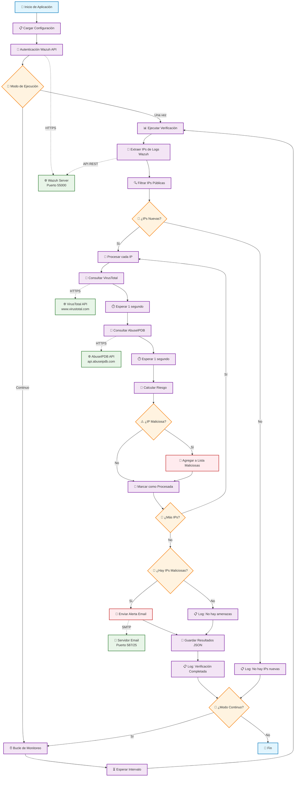

Sistema automático de verificación de reputación de IPs basado en logs de Wazuh, utilizando VirusTotal y AbuseIPDB para detectar IPs maliciosas y enviar alertas por correo electrónico.

Características.

✅ Extracción automática de IPs de logs de Wazuh

✅ Verificación de reputación usando VirusTotal y AbuseIPDB

✅ Alertas por email con información detallada

✅ Filtrado de IPs privadas (solo analiza IPs públicas)

Flujo Principal:

- Inicio y Configuración - Carga de configuración y autenticación
- Modos de Ejecución - Una vez o modo continuo
- Extracción de IPs - Obtención de IPs desde logs de Wazuh
- Filtrado - Solo IPs públicas y nuevas
- Verificación de Reputación - Consultas a VirusTotal y AbuseIPDB
- Análisis de Riesgo - Cálculo de puntuación de riesgo
- Alertas - Envío de emails si hay IPs maliciosas
- Persistencia - Guardado de resultados en JSON

Conexiones Externas:

🌐 Wazuh Server (Puerto 55000) - API REST para obtener logs y alertas

🌐 VirusTotal API - Verificación de reputación de IPs

🌐 AbuseIPDB API - Consulta de reportes de abuso

📧 Servidor Email (Puerto 587/25) - Envío de alertas por SMTP

Características del Flujo:

- Rate Limiting - Esperas de 1 segundo entre consultas API
- Cache de IPs - Evita consultas repetidas
- Modo Continuo - Bucle de monitoreo con intervalos configurables
- Manejo de Errores - Logs y continuidad del servicio
- Filtrado Inteligente - Solo IPs públicas y nuevas

El diagrama está codificado por colores para facilitar la comprensión:

- Azul: Inicio/Fin
- Púrpura: Procesos
- Naranja: Decisiones
- Verde: Conexiones externas
- Rojo: Alertas y amenazas

