# Wazuh IP Reputation Checker


## 📋 Descripción

Wazuh IP Reputation Checker es un sistema avanzado de análisis de reputación de IPs que se integra con Wazuh SIEM para enriquecer automáticamente los eventos de seguridad con información de inteligencia de amenazas de múltiples fuentes.

### Características Principales

- 🔍 **Integración con Wazuh API**: Extracción automática de IPs desde alertas de Wazuh
- 🌐 **Múltiples fuentes de inteligencia**:
  - VirusTotal
  - AbuseIPDB
  - Shodan
- 📊 **Sistema de puntuación de riesgo**: Clasificación automática de IPs (CRITICAL, HIGH, MEDIUM, LOW, SAFE)
- 📧 **Notificaciones inteligentes**: Alertas por email con formato HTML enriquecido
- 💾 **Base de datos MariaDB/MySQL**: Almacenamiento persistente con estadísticas históricas
- 🔄 **Monitoreo continuo**: Análisis automático con intervalos configurables
- 🛡️ **Cache inteligente**: Evita consultas repetidas a las APIs
- 📈 **Estadísticas y reportes**: Métricas detalladas del sistema
- 🔧 **Herramientas de administración**: CLI completa para gestión

## 🏗️ Diagrama conceptual

```
┌─────────────────┐     ┌─────────────────┐     ┌─────────────────┐
│   Wazuh SIEM    │────▶│  IP Reputation  │────▶│   Threat Intel  │
│   (Alertas)     │     │    Checker      │     │      APIs       │
└─────────────────┘     └────────┬────────┘     └─────────────────┘
                                 │                         │
                                 ▼                         ▼
                        ┌─────────────────┐     ┌─────────────────┐
                        │  Base de Datos  │     │  VirusTotal     │
                        │  MariaDB/MySQL  │     │  AbuseIPDB      │
                        └─────────────────┘     │  Shodan         │
                                 │              └─────────────────┘
                                 ▼
                        ┌─────────────────┐
                        │ Notificaciones  │
                        │     Email       │
                        └─────────────────┘
```
##  🔓 Arquitectura del Sistema

```mermaid
graph TB
    subgraph "Wazuh Infrastructure"
        WAZUH[🛡️ Wazuh Manager<br/>API v4.x]
        AGENTS[🖥️ Wazuh Agents<br/>Active Endpoints]
        ALERTS[(📊 Wazuh Alerts<br/>Security Events)]
        
        AGENTS -->|Send Events| WAZUH
        WAZUH -->|Generate| ALERTS
    end
    
    subgraph "External Integrations"
        SURICATA[🔍 Suricata IDS<br/>Network Traffic]
        PFSENSE[🔥 pfSense<br/>Firewall Logs]
        OTHER[📡 Other Sources<br/>Custom Integrations]
        
        SURICATA -->|data.flow.*| WAZUH
        PFSENSE -->|Firewall Events| WAZUH
        OTHER -->|Custom Fields| WAZUH
    end
    
    subgraph "Reputation APIs"
        VT[🔍 VirusTotal API<br/>v3.0]
        ABUSE[🛡️ AbuseIPDB<br/>v2.0]
        SHODAN[🌐 Shodan API<br/>Host Intelligence]
    end
    
    subgraph "IP Reputation Core v3.0.0"
        EXTRACTOR[🔎 IP Extractor<br/>Multi-source Parser]
        ANALYZER[📊 Reputation Analyzer<br/>Risk Scoring Engine]
        SCHEDULER[⏰ Scheduler<br/>Continuous Monitoring]
        CACHE[💾 Cache Manager<br/>Performance Optimization]
        
        SCHEDULER -->|Trigger| EXTRACTOR
        EXTRACTOR -->|Valid IPs| ANALYZER
        ANALYZER -->|Check Cache| CACHE
    end
    
    subgraph "Field Configuration"
        FIELDS[📋 network_fields.yml<br/>Customizable Fields]
        STANDARD[📌 Standard Fields<br/>data.srcip/dstip]
        CUSTOM[🔧 Custom Fields<br/>User Defined]
        
        FIELDS -->|Configure| EXTRACTOR
        STANDARD -->|Default| FIELDS
        CUSTOM -->|Extend| FIELDS
    end
    
    subgraph "Data Processing"
        VALIDATOR[✅ IP Validator<br/>Public IP Filter]
        SCORER[📈 Risk Calculator<br/>Weighted Scoring]
        DEDUP[🔄 Deduplicator<br/>Unique IP Processing]
        
        EXTRACTOR -->|Raw IPs| VALIDATOR
        VALIDATOR -->|Public IPs| DEDUP
        DEDUP -->|Unique Set| ANALYZER
        ANALYZER -->|API Results| SCORER
    end
    
    subgraph "Data Layer"
        DB[(🗄️ MySQL/MariaDB<br/>IP Reputation DB)]
        PROCESSED[(📝 Processed IPs<br/>Wazuh Events)]
        STATS[(📊 System Stats<br/>Metrics & Analytics)]
        ALERTS_DB[(🚨 Sent Alerts<br/>Notification History)]
        
        SCORER -->|Store Results| DB
        EXTRACTOR -->|Log Sources| PROCESSED
        ANALYZER -->|Update| STATS
    end
    
    subgraph "Notification System"
        ALERTENGINE[🚨 Alert Engine<br/>Threshold Detection]
        EMAILER[📧 Email Composer<br/>HTML/Plain Text]
        SMTP[📮 SMTP Gateway<br/>TLS Support]
        
        SCORER -->|Risk Level| ALERTENGINE
        ALERTENGINE -->|Generate| EMAILER
        EMAILER -->|Send via| SMTP
        EMAILER -->|Log| ALERTS_DB
    end
    
    subgraph "System Integration"
        SYSTEMD[⚙️ Systemd Service<br/>Auto-restart]
        CLI[🔧 wazuh-reputation<br/>Admin CLI Suite]
        CONFIG[📁 Configuration<br/>config.ini]
        LOGS[📋 Structured Logs<br/>Rotating Files]
        
        SYSTEMD -->|Manage| SCHEDULER
        CLI -->|Control| SCHEDULER
        CONFIG -->|Settings| EXTRACTOR
        CONFIG -->|Settings| ANALYZER
    end
    
    subgraph "API Interactions"
        WAZUH -->|REST API + Token| EXTRACTOR
        ANALYZER -->|HTTPS| VT
        ANALYZER -->|HTTPS| ABUSE
        ANALYZER -->|HTTPS| SHODAN
        
        VT -->|Malware Intel| SCORER
        ABUSE -->|Abuse Reports| SCORER
        SHODAN -->|Host Data| SCORER
    end
    
    subgraph "Test & Debug Features"
        TESTMODE[🧪 Test Mode<br/>Sample IPs]
        EMAILTEST[📧 Email Test<br/>Config Validation]
        APITEST[🔌 API Test<br/>Connectivity Check]
        
        TESTMODE -->|Generate| EXTRACTOR
        EMAILTEST -->|Verify| SMTP
        APITEST -->|Check| VT
        APITEST -->|Check| ABUSE
        APITEST -->|Check| SHODAN
    end
    
    subgraph "Data Flow Endpoints"
        VULN[🔓 Vulnerabilities<br/>/vulnerability/id]
        SYSCHECK[📁 File Integrity<br/>/syscheck/id]
        MANAGER[📊 Manager Logs<br/>/manager/logs]
        ALERTSAPI[🚨 Alerts API<br/>/alerts]
        
        VULN -->|CVE Data| EXTRACTOR
        SYSCHECK -->|File Events| EXTRACTOR
        MANAGER -->|System Logs| EXTRACTOR
        ALERTSAPI -->|Security Events| EXTRACTOR
    end
```


## 📁 Estructura de archivos

```
/opt/wazuh-ip-reputation/          # Directorio principal de la aplicación
├── wazuh_ip_reputation.py         # Script principal
├── venv/                          # Entorno virtual Python
└── requirements.txt               # Dependencias Python

/etc/wazuh-ip-reputation/          # Configuración
└── config.ini                     # Archivo de configuración principal

/var/log/wazuh-ip-reputation/      # Logs del sistema
├── wazuh-ip-reputation.log        # Log principal
└── backup.log                     # Log de backups

/var/lib/wazuh-ip-reputation/      # Datos persistentes
├── cache/                         # Cache temporal
├── scripts/                       # Scripts auxiliares
│   └── backup.sh                  # Script de backup automático
└── backups/                       # Backups de base de datos

/usr/local/bin/                    # Comandos del sistema
└── wazuh-reputation               # Comando principal de administración
```

## 🚀 Instalación

### Requisitos del Sistema

- **Sistema Operativo**: Ubuntu 24.04 LTS (compatible con 20.04+)
- **Python**: 3.8 o superior
- **Base de Datos**: MariaDB 10.5+ o MySQL 8.0+
- **RAM**: Mínimo 2GB (recomendado 4GB+)
- **Disco**: Mínimo 10GB libres
- **Red**: Acceso a Internet para APIs externas
- **Wazuh**: Versión 4.3+ con API habilitada

### Recomendaciones

- 🔑 **API Keys**: Obtener API keys antes de la instalación:
  - [VirusTotal API Key](https://www.virustotal.com/gui/my-apikey)
  - [AbuseIPDB API Key](https://www.abuseipdb.com/account/api)
  - [Shodan API Key](https://account.shodan.io/)
  
- 📧 **Email**: Para Gmail, crear una [contraseña de aplicación](https://myaccount.google.com/apppasswords)

### Instalación Rápida

```bash
# Descargar el script de instalación
wget https://raw.githubusercontent.com/juanpadiaz/wazuh-ip-reputation/main/wazuh_ip_reputation_install.sh

# Dar permisos de ejecución
chmod +x wazuh_ip_reputation_install.sh

# Ejecutar instalación
sudo bash wazuh_ip_reputation_install.sh
```

## ⚙️ Configuración

### Configuración durante la Instalación

El instalador solicitará interactivamente:

1. **Configuración de Wazuh**:
   - Host/IP del Wazuh Manager
   - Puerto de la API (default: 55000)
   - Usuario y contraseña de la API

2. **API Keys de Reputación**:
   - VirusTotal API Key
   - AbuseIPDB API Key
   - Shodan API Key (opcional)

3. **Notificaciones por Email**:
   - Servidor SMTP y puerto
   - Email remitente y contraseña
   - Emails destinatarios (separados por comas)

### Actualizar Configuración

```bash
# Editar configuración manualmente
sudo wazuh-reputation config

# O usar el editor directamente
sudo nano /etc/wazuh-ip-reputation/config.ini
```

### Archivo de Configuración (config.ini)

```ini
[general]
log_level = INFO
log_file = /var/log/wazuh-ip-reputation/wazuh-ip-reputation.log
check_interval = 300        # Segundos entre análisis
cache_duration = 3600       # Segundos de cache por IP

[database]
host = localhost
port = 3306
database = wazuh_ip_reputation
user = wazuh_ip_user
password = ****************

[wazuh]
host = 192.168.1.100       # IP del Wazuh Manager
port = 55000
username = admin
password = ****************
verify_ssl = false

[apis]
virustotal_key = ********************************
abuseipdb_key = ********************************
shodan_key = ********************************

[email]
enabled = true
smtp_server = smtp.gmail.com
smtp_port = 587
sender_email = alerts@example.com
sender_password = ****************
recipient_emails = security@example.com,admin@example.com

[thresholds]
critical = 90              # Score >= 90 = CRITICAL
high = 70                  # Score >= 70 = HIGH
medium = 40                # Score >= 40 = MEDIUM
low = 20                   # Score >= 20 = LOW
```
### Archivo de campos utilizados para la evualuación (network_fields.yml)

```yaml
# Campos estándar
standard_fields:
  - field: data.srcip
    description: "IP de origen estándar"

# Campos de Suricata
suricata_fields:
  - field: data.flow.src_ip
    description: "IP origen de Suricata"

# Campos personalizados
custom_fields:
  - field: data.mi_integracion.ip_field
    description: "Mi campo personalizado"

# Estructuras anidadas a explorar
nested_structures:
  - data.flow
  - data.network

# Campos a ignorar
ignore_fields:
  - data.hostname

```
## 🛠️ Comandos de Administración

```bash
# Gestión del servicio
sudo wazuh-reputation start              # Iniciar servicio
sudo wazuh-reputation stop               # Detener servicio
sudo wazuh-reputation restart            # Reiniciar servicio
sudo wazuh-reputation status             # Ver estado y estadísticas

# Operaciones
sudo wazuh-reputation check-once         # Ejecutar análisis manual
sudo wazuh-reputation test-apis          # Probar conexión con APIs
sudo wazuh-reputation clear-cache        # Limpiar cache de IPs
sudo wazuh-reputation test-email    # Probar el envío de notificaciones por correo electrónico

# Consultas
sudo wazuh-reputation show-stats         # Mostrar estadísticas detalladas
sudo wazuh-reputation show-ips [N]       # Mostrar últimas N IPs analizadas
sudo wazuh-reputation show-alerts [N]    # Mostrar últimas N alertas enviadas

# Mantenimiento
sudo wazuh-reputation logs               # Ver logs en tiempo real
sudo wazuh-reputation backup             # Crear backup manual
sudo wazuh-reputation config             # Editar configuración
sudo wazuh-reputation test-email         # Probar configuración de email
sudo wazuh-reputation show-fields        # Ver campos de red configurados
sudo wazuh-reputation edit-fields        # Editar campos para evaluación personalizados
sudo wazuh-reputation check-once         # ejecutar la aplicación completa, útil si se habilita el modo de prueba
```

## 📊 Gestión del Servicio

### Estado del Servicio

```bash
# Ver estado completo
sudo systemctl status wazuh-ip-reputation

# Ver logs del servicio
sudo journalctl -u wazuh-ip-reputation -f

# Habilitar inicio automático
sudo systemctl enable wazuh-ip-reputation
```
### Activar/Desactivar modo de prueba
```bash
# Activar modo de prueba
sudo wazuh-reputation test-mode-on

# Desactivar modo de prueba
sudo wazuh-reputation test-mode-off

# Reiniciar para aplicar cambios
sudo wazuh-reputation restart
```
### Editando la configuración:
```bash
# Editar configuración
sudo nano /etc/wazuh-ip-reputation/config.ini

# En la sección [general], agregar o modificar:
test_mode = true   # o false para desactivar

# Reiniciar el servicio
sudo systemctl restart wazuh-ip-reputation
```
Verificación:
```
bash
# 1. Verificar el estado del servicio
sudo wazuh-reputation status

# 2. Probar la extracción de IPs
sudo wazuh-reputation check-once

# 3. Ver los logs en tiempo real
sudo wazuh-reputation logs

# 4. Si activaste el modo de prueba, deberías ver:
# "Modo de prueba activado - generando IPs de ejemplo"
# Y 3 IPs de prueba serán procesadas
```
### Agregar campos personalizados para su evaluación
1. **Editar el archivo**:
```bash
sudo wazuh-reputation edit-fields
````
2. **Agregar campos en la sección apropiada**:
```yaml
custom_fields:
  - field: data.mi_campo.ip_origen
    description: "IP de mi sistema personalizado"
```
3. **Reiniciar el servicio**:
```bash
sudo wazuh-reputation restart
```

### Sistema de Notificaciones

El sistema envía notificaciones automáticas cuando detecta IPs con niveles de riesgo CRITICAL, HIGH o MEDIUM.

#### Características de las Notificaciones:

- 📧 **Formato HTML enriquecido** con información detallada
- 🔔 **Deduplicación**: No repite alertas de la misma IP en 24 horas
- 📊 **Agrupación por severidad**: Organiza IPs por nivel de riesgo
- 🌍 **Información contextual**: País, ISP, puertos abiertos, detecciones

### Ejemplo de Notificación

```html
🚨 Alerta de Seguridad Wazuh
IPs Maliciosas Detectadas

⚠️ CRÍTICAS (2)
━━━━━━━━━━━━━━━━━━━━━━━━━━━━━━━━━━
IP: 192.168.1.100
Score de Riesgo: 95/100
Nivel: CRITICAL
País: CN
ISP: China Telecom
VT Detecciones: 15/87
Puertos: 22, 80, 443, 3389

⚠️ ALTAS (3)
━━━━━━━━━━━━━━━━━━━━━━━━━━━━━━━━━━
IP: 10.0.0.50
Score de Riesgo: 75/100
Nivel: HIGH
País: RU
ISP: Petersburg Internet Network
VT Detecciones: 8/87
```

## 🗑️ Desinstalación

```bash
# Descargar script de desinstalación
wget https://raw.githubusercontent.com/juanpadiaz/wazuh-ip-reputation/main/wazuh_ip_reputation_uninstall.sh

# Ejecutar desinstalación
sudo bash wazuh_ip_reputation_uninstall.sh

# Desinstalación sin confirmaciones
sudo bash wazuh_ip_reputation_uninstall.sh --force

# Desinstalar pero mantener la base de datos
sudo bash wazuh_ip_reputation_uninstall.sh --keep-database

# Desinstalar sin crear backup
sudo wazuh_ip_reputation_uninstall.sh --no-backup

# Ver ayuda
sudo bash wazuh_ip_reputation_uninstall.sh --help
```

El script de desinstalación permite:
- 🗑️ Elimina usuario del sistema
- 🗑️ Elimina grupo del sistema
- 📝 Verifica archivos remanentes
- ✅ Crear backup antes de desinstalar
- ❓ Eliminar base de datos (opcional)
- 📝 Conservar logs (opcional)
- 💾 Conservar datos históricos (opcional)

## 🔐 Seguridad

### Mejores Prácticas Implementadas

1. **Permisos del Sistema**:
   - Usuario dedicado sin shell (`wazuh-reputation`)
   - Archivos de configuración con permisos 640
   - Separación de privilegios

2. **Base de Datos**:
   - Usuario dedicado con permisos mínimos
   - Contraseñas generadas aleatoriamente
   - Conexiones solo desde localhost

3. **API Keys**:
   - Almacenadas en archivo protegido
   - No se muestran en logs
   - Rotación recomendada cada 90 días

4. **Comunicaciones**:
   - HTTPS para todas las APIs externas
   - TLS/STARTTLS para email
   - Verificación SSL configurable

## 🔧 Solución de Problemas

### Problemas Comunes

#### El servicio no inicia
```bash
# Verificar logs
sudo journalctl -u wazuh-ip-reputation -n 50

# Verificar configuración
sudo wazuh-reputation test-apis

# Verificar permisos
ls -la /etc/wazuh-ip-reputation/config.ini
```

#### No se reciben emails
```bash
# Probar configuración de email
sudo -u wazuh-reputation /opt/wazuh-ip-reputation/venv/bin/python << EOF
import smtplib
# Verificar conexión SMTP
EOF

# Para Gmail: verificar contraseña de aplicación
# Para otros: verificar puerto y autenticación
```

#### Error de API rate limit
```bash
# VirusTotal: Límite 4 requests/minuto (sin API key)
# AbuseIPDB: Límite 1000 requests/día
# Shodan: Límite según plan

# Solución: Aumentar cache_duration en config.ini
```

#### Base de datos llena
```bash
# Ver tamaño de tablas
mysql -u root -p -e "
SELECT table_name, ROUND(data_length/1024/1024, 2) AS 'Size MB'
FROM information_schema.tables
WHERE table_schema = 'wazuh_ip_reputation';"

# Limpiar datos antiguos (>90 días)
mysql -u root -p wazuh_ip_reputation -e "
DELETE FROM processed_ips WHERE processed_at < DATE_SUB(NOW(), INTERVAL 90 DAY);
DELETE FROM sent_alerts WHERE sent_at < DATE_SUB(NOW(), INTERVAL 90 DAY);"
```

## 📊 Métricas del Proyecto

- **Líneas de código**: ~2,800
- **Archivos Python**: 2
- **Scripts Bash**: 2
- **Tablas de BD**: 5
- **APIs integradas**: 4 (Wazuh + 3 threat intel)
- **Tiempo promedio de análisis por IP**: 3-5 segundos
- **Uso de memoria**: ~100-200 MB
- **Almacenamiento requerido**: ~1GB inicial + crecimiento según uso

## 📝 Changelog

### Versión 3.0.0 (2024-07-28)
- ✅Soporte mejorado para integraciones:
    - Suricata: data.flow.src_ip, data.flow.dest_ip
    - pfSense: Campos de firewall
    - IDS/IPS: Campos genéricos
    - Aplicaciones web: Headers y campos específicos
- 📋Comando para probar email
- ✨Archivo de campos personalizables
- ✨Soporte mejorado para integraciones
- ✨Método de extracción mejorado

### Versión 2.0.2 (2024-07-12)
- 📋Busca en múltiples endpoints de Wazuh
- ✅Incluye vulnerabilidades y eventos de integridad
- ✅Modo de prueba para generar IPs de ejemplo
- ✅Mejor logging y manejo de errores

### Versión 2.0.1 (2024-06-08)
- 📋 Cambios principales en la versión 2.0.1:
- ✅ Corrección de VirusTotal API:
- ✨URL correcta: https://www.virustotal.com/api/v3/ip-addresses/{ip}
- ✨Headers apropiados: 'x-apikey' y 'Accept: application/json'
- ✨Mejor manejo de respuestas 404 (IP no encontrada)
- ✨Navegación correcta en la estructura JSON de respuesta
- ✨Solo busca en endpoint /alerts
- ✨Requiere alertas activas para encontrar IPs
- ✅ Otras mejoras:
    - ✨Actualizada la versión a 2.0.1 en todo el código
    - ✨Mejor manejo de errores en todas las APIs
    - ✨Logging mejorado para diagnóstico

### Versión 2.0.0 (2024-06-02)
- 🎉 Release inicial completo
- ✨ Integración con Wazuh API
- ✨ Soporte para VirusTotal, AbuseIPDB y Shodan
- ✨ Sistema de puntuación de riesgo
- ✨ Notificaciones por email HTML
- ✨ Base de datos MariaDB/MySQL
- ✨ Herramientas de administración CLI
- ✨ Sistema de cache inteligente
- ✨ Backup automático
- ✨ Instalador y desinstalador interactivos

### Roadmap Futuro
- 📅 v3.1.0: Integración con más APIs (AlienVault OTX, ThreatCrowd)
- 📅 v3.2.0: Dashboard web para visualización
- 📅 v3.3.0: Integración con Elastic Stack
- 📅 v4.0.0: Machine Learning para detección de anomalías

---

## 👨‍💻 Autor y Licencia

- **Desarrollador**: Juan Pablo Díaz Ezcurdia
- **Website**: [jpdiaz.com](https://jpdiaz.com)
- **Licencia**: MIT License
- **Versión**: 3.0.0
- **Última actualización**: Julio 2025

---

**Nota**: Este sistema está diseñado para complementar, no reemplazar, las herramientas de seguridad existentes. Siempre valide los resultados y mantenga actualizadas todas sus herramientas de seguridad.
